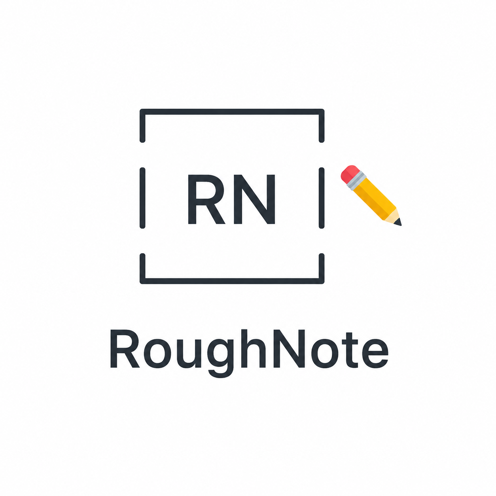

<div align="center">
  <!-- Ensure you place the logo image at assets/logo.png -->
  
  <h1>RoughNote</h1>
  <p>A native Linux drawing and comprehensive note-taking application built with Rust and GTK4.</p>
</div>

## Overview
RoughNote (formerly SimplePaint) is a native Linux application designed for drawing, handwriting, and comprehensive note-taking. It aims to provide a robust feature set tailored specifically for the Linux ecosystem, serving as a powerful open-source tool for digital note-taking and illustration.

## Features (Planned & Implemented)
- **Inking and Drawing (Core Canvas):** Pen, Pencil, Highlighter, and Marker tools. Pressure sensitivity support for drawing tablets.
- **Erasers & Selection:** Stroke and Standard Erasers. Lasso selection to move, resize, and rotate.
- **Shapes:** Insert standard geometric shapes with planned support for auto-recognizing hand-drawn shapes.
- **Note-taking & Text:** Infinite canvas, rich text formatting, lists, and LaTeX/MathML equation support.
- **Organization:** Notebooks, Sections, Pages with customizable page backgrounds (Grid, Ruled, Blank).
- **Multimedia:** Insert images, PDFs, attachments, audio recordings, and tables.
- **Linux Integration:** Custom lossless save formats, standard exports (PDF, PNG, SVG), automatic Light/Dark mode syncing, and full Wayland/X11 support.

## Tech Stack
- **Language:** Rust (Edition 2024)
- **GUI Framework:** GTK4 
- **Graphics/Rendering:** Cairo for high-performance canvas rendering

## Getting Started

### Prerequisites
Make sure you have Rust and Cargo installed, as well as the GTK4 development libraries for your system.

**On Ubuntu/Debian:**
```bash
sudo apt install libgtk-4-dev
```

**On Fedora:**
```bash
sudo dnf install gtk4-devel
```

### Build & Run Locally
To compile and run the application locally from source:
```bash
cargo run --release
```

---

## Installation & Packaging

### Debian / Ubuntu

You can build and install the application on Debian/Ubuntu in two ways:

#### Option 1: Direct Build and Install
1. Install build dependencies:
   ```bash
   sudo apt update
   sudo apt install -y cargo git libgtk-4-dev pkg-config
   ```
2. Build the release binary:
   ```bash
   cargo build --release --locked
   ```
3. Install the binary directly to `/usr/bin`:
   ```bash
   sudo install -Dm755 target/release/roughnote /usr/bin/roughnote
   ```

#### Option 2: Build as a Native `.deb` Package
Using the pre-structured [debian-pkg](file:///home/robin/Projects/ClassBoard/debian-pkg) folder, you can build and install a `.deb` package:
1. Build the release binary:
   ```bash
   cargo build --release --locked
   ```
2. Copy the compiled binary into the pre-structured directory:
   ```bash
   cp target/release/roughnote debian-pkg/usr/bin/
   ```
3. Generate the `.deb` package:
   ```bash
   dpkg-deb --build debian-pkg roughnote_0.1.0_amd64.deb
   ```
4. Install the package:
   ```bash
   sudo apt install ./roughnote_0.1.0_amd64.deb
   ```

### Arch Linux

A [PKGBUILD](file:///home/robin/Projects/ClassBoard/PKGBUILD) is available in the repository root for Arch Linux native installation.

1. Ensure you have the `base-devel` package group installed:
   ```bash
   sudo pacman -S base-devel
   ```
2. Build and install the package:
   ```bash
   makepkg -si
   ```

---

### Cross-Compilation
The project includes a `build.sh` script to build binaries for both Linux and Windows (x86_64 and x86_32).
```bash
./build.sh
```
*Note: Cross-compilation requires the appropriate C toolchains (like `mingw-w64` for Windows) and GTK4 development headers for the target architecture.*

